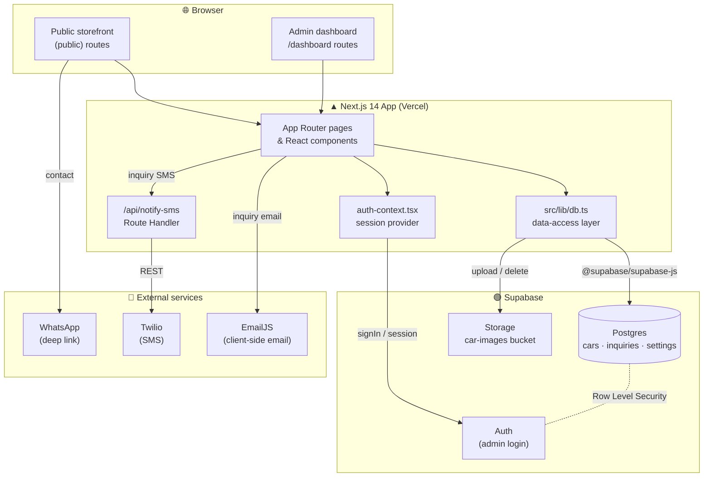
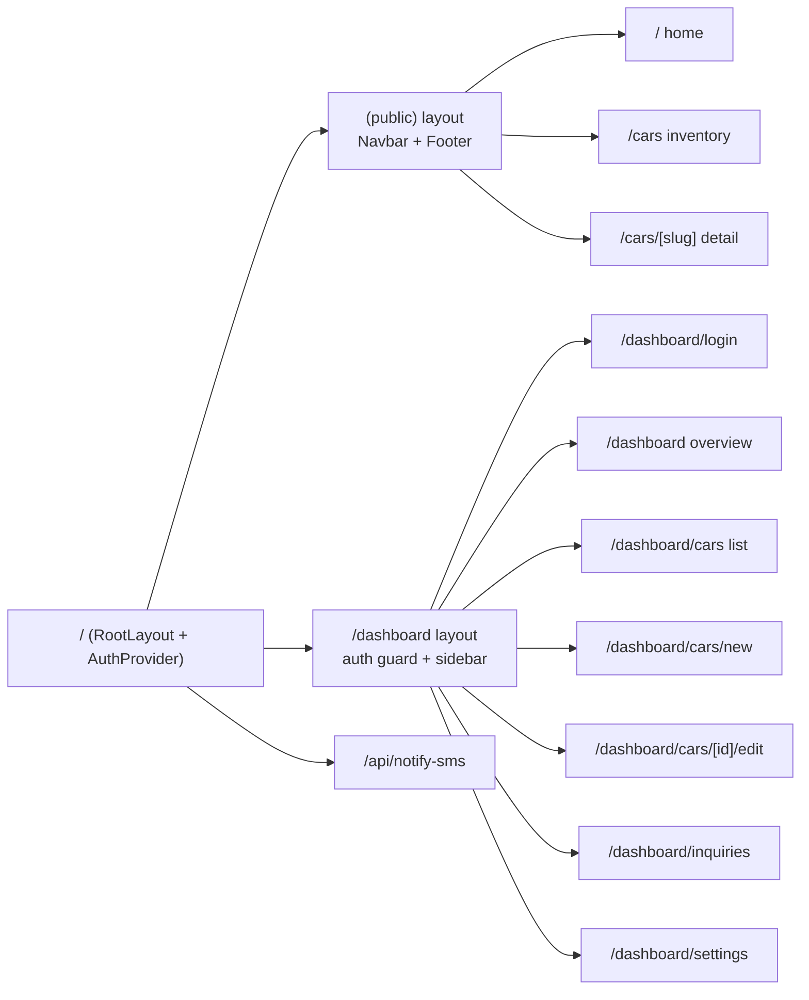
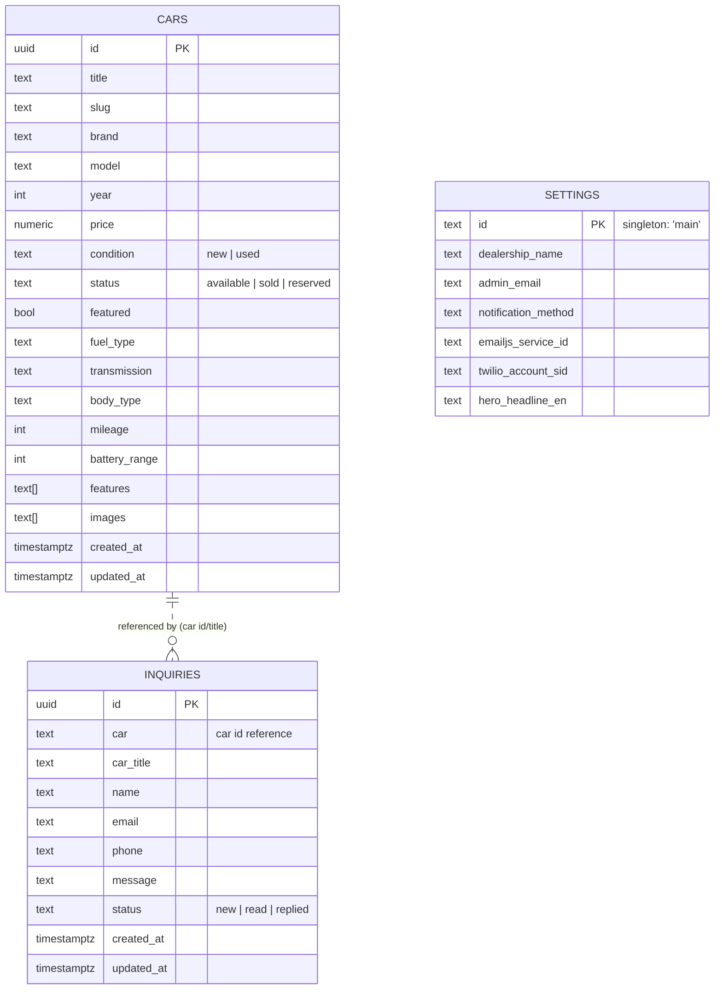
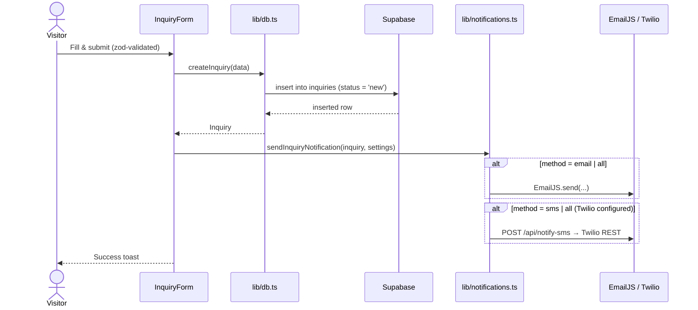
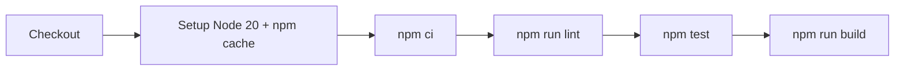

# EV Auto CHINA — Kigali 🚗⚡

A full-stack car‑dealership storefront and admin dashboard, focused on new & used
electric vehicles for the Rwandan market. Built with **Next.js 14 (App Router)**,
**TypeScript**, **Tailwind CSS**, and **Supabase** (Postgres + Auth + Storage).

Visitors browse and filter inventory and submit inquiries; administrators manage
cars, respond to inquiries, and configure the site from a protected dashboard.
Inquiry notifications are delivered via **EmailJS** (client‑side email) and
optionally **Twilio SMS** and **WhatsApp** links.

---

## Screenshots

### Public storefront — home / hero


> Save the hero screenshot from the project brief to
> [`docs/screenshots/home-hero.png`](docs/screenshots/) so it renders here. See
> [`docs/screenshots/README.md`](docs/screenshots/README.md) for the full list of
> expected images (browse, car detail, dashboard).

---

## Features

**Public storefront**
- Animated hero with featured‑vehicle carousel and live inventory stats
- Inventory browsing with server‑side filtering (brand, condition, fuel type,
  transmission, body type, price/year ranges), full‑text search, sorting, and
  pagination — filter state is synced to the URL via `nuqs`
- Per‑vehicle detail pages (image gallery, specs, features) with slug‑based routing
- Inquiry form with `react-hook-form` + `zod` validation
- RWF currency formatting, EV‑specific fields (battery range), English (EN‑only) UI

**Admin dashboard** (`/dashboard`, Supabase‑Auth protected)
- Overview with stat cards (total / available / sold cars, inquiries)
- Full CRUD for cars, including image upload to Supabase Storage
- Inquiry inbox with status management (new / read / replied)
- Site settings: dealership info, notification method, EmailJS/Twilio credentials,
  hero copy, social links, logo

**Notifications**
- Email via EmailJS (client‑side)
- SMS via Twilio through a Next.js API route (`/api/notify-sms`)
- WhatsApp deep‑link helper

---

## Tech stack

| Layer | Technology |
| --- | --- |
| Framework | Next.js 14 (App Router, RSC) |
| Language | TypeScript 5 |
| Styling | Tailwind CSS 3, `clsx` + `tailwind-merge` |
| Animation | Framer Motion |
| Icons | lucide-react |
| Backend / DB | Supabase (Postgres, Auth, Storage) |
| Forms & validation | react-hook-form, zod |
| URL state | nuqs |
| Notifications | EmailJS, Twilio (via API route) |
| Toasts | react-hot-toast |
| Testing | Vitest (+ v8 coverage) |
| CI | GitHub Actions |

---

## Architecture

### System overview



### Route structure



### Data model



> `inquiries.car` stores the car's id as a loose reference (not an enforced FK), and
> `car_title` is denormalized so inquiries survive if a car is later removed.

### Inquiry submission flow



---

## Project structure

```
cars-ecom/
├── src/
│   ├── app/
│   │   ├── (public)/            # Storefront (Navbar + Footer layout)
│   │   │   ├── page.tsx         # Home
│   │   │   └── cars/            # Inventory list + [slug] detail
│   │   ├── dashboard/           # Admin (auth-guarded layout)
│   │   │   ├── cars/            # List, new, [id]/edit
│   │   │   ├── inquiries/
│   │   │   ├── settings/
│   │   │   └── login/
│   │   ├── api/notify-sms/      # Twilio SMS route handler
│   │   ├── layout.tsx           # RootLayout + AuthProvider + Toaster
│   │   └── globals.css
│   ├── components/
│   │   ├── public/             # CarCard, Navbar, Footer, InquiryForm
│   │   └── dashboard/          # CarForm
│   ├── lib/
│   │   ├── supabase.ts         # Supabase client
│   │   ├── db.ts               # Data-access layer (cars, inquiries, settings, stats)
│   │   ├── auth-context.tsx    # Auth provider / useAuth hook
│   │   ├── notifications.ts    # Email / SMS / WhatsApp
│   │   ├── i18n.ts             # EN translations
│   │   ├── utils.ts            # formatPrice, slugify, catalog constants…
│   │   └── __tests__/          # Vitest unit tests
│   └── types/index.ts          # Car, Inquiry, Settings, FilterState
├── docs/screenshots/           # README images
├── supabase-schema.sql         # DB schema, RLS policies, storage bucket
├── .github/workflows/ci.yml    # Lint · Test · Build
├── vitest.config.ts
└── next.config.js
```

---

## Getting started

### Prerequisites

- **Node.js 20+** and npm
- A **Supabase** project (free tier is fine)
- *(Optional)* EmailJS and/or Twilio accounts for inquiry notifications

### 1. Clone & install

```bash
git clone <your-repo-url>
cd cars-ecom
npm install
```

### 2. Configure environment

Copy the example env file and fill in your Supabase credentials
(Supabase Dashboard → Project Settings → API):

```bash
cp .env.example .env.local
```

```dotenv
# .env.local
NEXT_PUBLIC_SUPABASE_URL=https://your-project.supabase.co
NEXT_PUBLIC_SUPABASE_ANON_KEY=your-anon-key
```

> Only the **public anon** key is used client‑side; access is constrained by
> Row Level Security. EmailJS and Twilio credentials are stored per‑deployment in
> the **Settings** table via the admin dashboard, not in env vars.

### 3. Set up the database

In the Supabase Dashboard → **SQL Editor**, run
[`supabase-schema.sql`](supabase-schema.sql). This creates the `cars`, `inquiries`,
and `settings` tables, indexes, `updated_at` triggers, Row Level Security policies,
and the public `car-images` storage bucket.

### 4. Create an admin user

In Supabase Dashboard → **Authentication → Users → Add user**, create an
email/password user. Any authenticated Supabase user is treated as an admin and can
sign in at `/dashboard/login`.

### 5. Run the dev server

```bash
npm run dev
```

Open **http://localhost:3000** for the storefront and
**http://localhost:3000/dashboard** for the admin dashboard.

---

## Available scripts

| Command | Description |
| --- | --- |
| `npm run dev` | Start the Next.js dev server |
| `npm run build` | Production build |
| `npm start` | Serve the production build |
| `npm run lint` | Run ESLint (`next lint`) |
| `npm test` | Run the Vitest suite once |
| `npm run test:watch` | Run tests in watch mode |
| `npm run test:coverage` | Run tests with a v8 coverage report |

---

## Testing

Unit tests are written with [Vitest](https://vitest.dev/) and live in
`src/**/__tests__/`. The current suite covers the pure helpers in
[`src/lib/utils.ts`](src/lib/utils.ts) — currency/mileage formatting, slug
generation, class merging, title fallbacks, and catalog constants.

```bash
npm test              # single run
npm run test:watch    # watch mode
npm run test:coverage # coverage report (coverage/ + terminal summary)
```

```
 ✓ src/lib/__tests__/utils.test.ts (18 tests)

 Test Files  1 passed (1)
      Tests  18 passed (18)
```

**Extending coverage:** the data‑access layer (`src/lib/db.ts`) and notifications
(`src/lib/notifications.ts`) can be tested by mocking the Supabase client and
`@emailjs/browser`/`fetch`. Add new test files alongside the code as
`*.test.ts` / `*.test.tsx`.

---

## Continuous integration

Every push and pull request to `main` runs the
[CI workflow](.github/workflows/ci.yml) on GitHub Actions:



The build step reads `NEXT_PUBLIC_SUPABASE_URL` and `NEXT_PUBLIC_SUPABASE_ANON_KEY`
from GitHub **Actions secrets** — add them under
*Settings → Secrets and variables → Actions* so the production build can prerender
pages. (Falling back to placeholders keeps the build green even without secrets.)

---

## Deployment

The app is a standard Next.js project and deploys cleanly to **Vercel**:

1. Import the repository into Vercel.
2. Set `NEXT_PUBLIC_SUPABASE_URL` and `NEXT_PUBLIC_SUPABASE_ANON_KEY` as environment
   variables.
3. Deploy. `next.config.js` already allow‑lists `*.supabase.co` for `next/image`
   remote patterns.

---

## Security notes

- Access control is enforced by **Supabase Row Level Security** (see
  `supabase-schema.sql`): public read on cars/settings, public insert on inquiries,
  and authenticated‑only writes everywhere else.
- Twilio credentials never reach the browser for the send itself — SMS is dispatched
  from the server‑side `/api/notify-sms` route handler.
- Only the Supabase **anon** key is exposed to the client, which is expected and safe
  when paired with RLS.

---

## License

Private / proprietary. All rights reserved.
